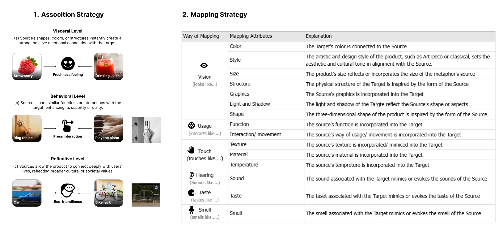

# ProductMetaphor Dataset

## Overview

We introduce a dataset of extended metaphors for product design.

* The labels for metaphors were collected from websites and papers about metaphorical product design, the sources are mainly from Product design studio, Pinterest. 
* The descriptions of the connection and the mapping method are based on the official introduction of the design on the website.
* We conducted a comprehensive evaluation of state-of-the-art zero-shot GPT-4 models on metaphor understanding tasks based on 80 classical metaphorical product design images.
* The result shows that...

### [product_metaphor_list](product_metaphor_list_3level.csv)
 150 product metaphors that consist of XXX:
* image_path: the product's image
* name: the products' name
* target: the target product
* source: the source product
* way of connection: The connection between the source with the target, including:
  1. visceral：视觉形态（Visual Similarity）引起用户情感 (User Emotion)   through similarity between the shape, color, structure--it  can evoke a special emotion immediately for users.
     * connection Format: 
          B visually resembles A, evokes [specific emotion or feeling] in [A's target users]
          B is as adj. as A
  2. 行为层 behavioral：Through similarity between interaction, function and behavior, the source can make the target usable or increase its utility. Think about: how users use this product and how to think about more 
     * connection Format: 
          Both B and A + verb. + adv. / in a similar manner; 
          [B +  verb. ] like [A + verb.];
          Both B and A allow for [specific interaction] similarly ; [Interacting with B] interacts/ behaves like [interacting with A]
  3. 反思层 reflective：The adding of source might influence the usage conetxt of the product and transfer the meaning of using it, promoting/symbolizing a new meaning for using it. 
     * connection Format: 
     - B is inspired by [legend/ story]
     - Both B and A symbolize/ associate with [specific cultural meaning]
     - B creates a + adj. experience in + [specific using environment] 
     - B symbolizes/promotes [concept/thoughts] for A/ as using A
     - B  transform [A's usage experience] into a [new experience].

* way of mapping: the mapping attribute ( choose from: form, function, interaction)
 
* detail mapping: other properties that help to forster the metaphor expression


### GPT_result


### Expert_rate
 
* Fluency: The metaphor is fluent, grammatical, and easy to understand.
* Scientific Precision: The reasons for the metaphor explain the scientific concepts precisely.
* Relatedness: The reasons for the metaphor closely connect the scientific concepts and metaphorical concepts.
* Validity: The reasons for the metaphor are valid overall. They perform a role as a scientific metaphor explaining the scientific concept in a more understandable and relatable way.
* Willingness to adopt: I'm willing to use this metaphor for my writing. 
* Inspirational effect: The metaphor example will inspire me to create metaphors.


## Files

* rating_vehicle.csv: professional writers' ratings on vehicles of metaphors
* rating_mapping.csv: professional writers' ratings on mappings of metaphors
* concepts_per_domain.csv: mapping between the scientific domains and scientific concepts

## Licensing

Labels are licensed under Creative Commons Attribution 4.0 License

## Contact

This section will be added after the blind review process.

## Citations

```
Jeongyeon Kim, Sangho Suh, Lydia Chilton, and Haijun Xia. "Metaphorian: Leveraging Large Language Models to Support Extended Metaphor Creation for Science Writing." In Designing Interactive Systems Conference, pp. 41-57. 2023.
```

```
@inproceedings{kim2023metaphorian,
  title={Metaphorian: Leveraging Large Language Models to Support Extended Metaphor Creation for Science Writing},
  author={Kim, Jeongyeon and Suh, Sangho and Chilton, Lydia and Xia, Haijun},
  booktitle={Designing Interactive Systems Conference},
  pages={41--57},
  year={2023}
}
```
